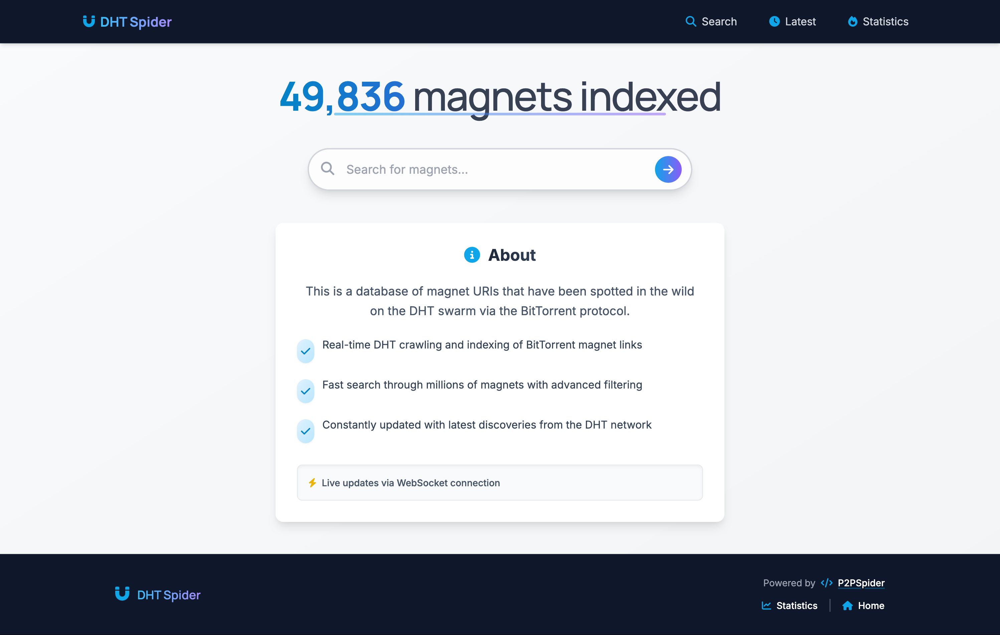
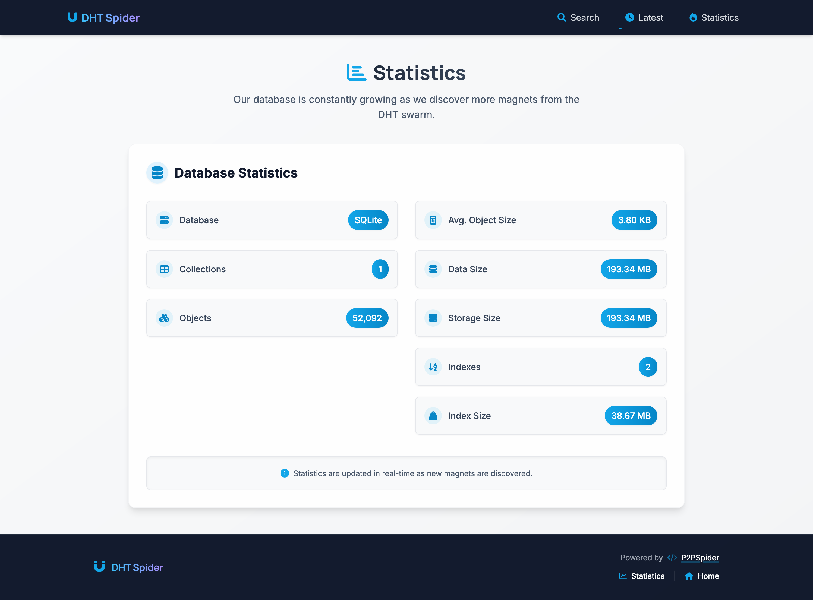

# p2pspider - DHT Spider

[](https://github.com/thejordanprice/p2pspider/issues)
[](https://github.com/thejordanprice/p2pspider/stargazers)
[](https://github.com/thejordanprice/p2pspider/network)
[](https://github.com/thejordanprice/p2pspider/blob/master/LICENSE)
[](https://twitter.com/intent/tweet?text=Wow:&url=https%3A%2F%2Fgithub.com%2Fthejordanprice%2Fp2pspider)

A daemon that crawls the BitTorrent DHT network and an Express web application that provides a searchable database of magnet links with real-time updates through WebSockets.

### Intro

DHT Spider can index over 1 million magnets per 24 hours on modest hardware (2GB of RAM and around 2MB/s connection). It's resource-intensive and will use available CPU and RAM, which can be controlled via the 'ecosystem.json' file. On 2GB RAM, it's recommended to use 8 instances of the daemon and 2 of the webserver, all limited at 175MB.

###### Screenshots





### Getting Started

```
# Install dependencies
npm install

# Set up configuration
cp .env.sample .env
# Edit .env file as needed

# Run the application
npm start  # Start the unified application (both crawler and web interface)

# Alternatively, use PM2 for process management
npm install -g pm2
npm run start:pm2  # Uses the ecosystem.json file
pm2 monit
```

### Configuration

**You will need to have port 6881 (or your configured port) open to the internet for the DHT crawler to function properly.**

The application can be configured through the `.env` file:

```
# Database and server configuration
REDIS_URI=redis://127.0.0.1:6379
MONGO_URI=mongodb://127.0.0.1/magnetdb
SITE_HOSTNAME=http://127.0.0.1:8080
SITE_NAME=DHT Spider
SITE_PORT=8080

# Database options: "mongodb" or "sqlite"
DB_TYPE=sqlite

# Redis options: "true" or "false"
USE_REDIS=false

# SQLite database file location (only used if DB_TYPE=sqlite)
SQLITE_PATH=./data/magnet.db

# Elasticsearch options: "true" or "false"
USE_ELASTICSEARCH=false

# Elasticsearch connection
ELASTICSEARCH_NODE=http://localhost:9200
ELASTICSEARCH_INDEX=magnets

# Component control options: "true" or "false"
RUN_DAEMON=true
RUN_WEBSERVER=true
```

You can also fine-tune the crawler performance in the daemon.js file:

```javascript
const p2p = P2PSpider({
    nodesMaxSize: 250,
    maxConnections: 500,
    timeout: 1000
});
```

It's not recommended to change the `nodesMaxSize` or `maxConnections`, but adjusting the `timeout` may increase indexing speed. Higher timeout values may require more RAM; the maximum recommended value is 5000ms.

#### Component Control

DHT Spider now allows you to run the daemon and webserver components independently:

- **RUN_DAEMON**: Set to "true" to run the P2P Spider daemon, or "false" to disable it
- **RUN_WEBSERVER**: Set to "true" to run the web server, or "false" to disable it

This flexibility allows you to:
- Run only the daemon for dedicated crawling
- Run only the webserver for serving existing data
- Run both components together (default behavior)

Example usage:
```bash
# Run both components (default)
node app.js

# Run only the daemon
RUN_WEBSERVER=false node app.js

# Run only the webserver
RUN_DAEMON=false node app.js
```

#### Database and Redis Configuration

DHT Spider supports both MongoDB and SQLite as database options, and Redis usage can be toggled on/off:

- **DB_TYPE**: Choose between "mongodb" or "sqlite" as your database
- **USE_REDIS**: Set to "true" to use Redis for caching recent infohashes, or "false" to disable Redis
- **SQLITE_PATH**: Path where the SQLite database file will be created (only used when DB_TYPE=sqlite)

SQLite is ideal for smaller deployments with reduced dependencies, while MongoDB is better for large-scale operations. Redis provides caching to prevent duplicate processing of recently seen infohashes.

#### Elasticsearch Configuration

DHT Spider now includes Elasticsearch integration for powerful full-text search capabilities:

- **USE_ELASTICSEARCH**: Set to "true" to enable Elasticsearch integration
- **ELASTICSEARCH_NODE**: URL of your Elasticsearch server (default: http://localhost:9200)
- **ELASTICSEARCH_INDEX**: Name of the Elasticsearch index to use (default: magnets)

To bulk index existing data into Elasticsearch, run:
```bash
node utils/bulkIndexToElasticsearch.js
```

Elasticsearch provides significantly improved search performance and relevance, especially for large datasets. When enabled, search queries will use Elasticsearch instead of database queries.

### Features

- Real-time DHT network crawling and magnet link indexing
- WebSocket-based live updates on the web interface
- Searchable database of discovered magnet links
- Statistics page with database information
- Support for both MongoDB and SQLite databases
- Elasticsearch integration for powerful full-text search
- Redis caching for improved performance
- Responsive web interface with modern design

### Protocols

[bep_0005](http://www.bittorrent.org/beps/bep_0005.html), [bep_0003](http://www.bittorrent.org/beps/bep_0003.html), [bep_0010](http://www.bittorrent.org/beps/bep_0010.html), [bep_0009](http://www.bittorrent.org/beps/bep_0009.html)

### Notes

Cluster mode does not work on Windows. On Linux and other UNIX-like operating systems, multiple instances can listen on the same UDP port, which is not possible on Windows due to operating system limitations.

### Notice

Please don't share the data DHT Spider crawls to the internet. Because sometimes it discovers sensitive/copyrighted/adult material.

### Performance Optimization

To maximize performance, DHT Spider now includes several optimizations:

#### 1. Redis Caching
Enable Redis by setting `USE_REDIS=true` in your `.env` file to significantly reduce database load:
```
# Redis options: "true" or "false"
USE_REDIS=true
```

#### 2. Production Mode
Run the application in production mode for better performance:
```bash
npm run start:prod   # For the web server
npm run daemon:prod  # For the DHT crawler

# Or with PM2 (recommended for production)
pm2 start ecosystem.json
```

#### 3. Optimized PM2 Configuration
The included `ecosystem.json` is configured for optimal performance:
- Web server runs in cluster mode with multiple instances
- DHT crawler runs in a single instance to avoid duplicate crawling
- Memory limits prevent excessive resource usage

#### 4. WebSocket Optimizations
The WebSocket server includes:
- Message batching to reduce overhead
- Client connection health monitoring
- Throttled broadcasts to prevent excessive updates

#### 5. Elasticsearch Search Optimization
When dealing with large datasets, enable Elasticsearch for improved search performance:
```
# Elasticsearch options: "true" or "false"
USE_ELASTICSEARCH=true
```

#### Monitoring Performance
Monitor system resources during operation:
```bash
pm2 monit
```

If the application is still slow:
1. Increase server resources (RAM/CPU)
2. Use a CDN for static assets
3. Consider using a dedicated Redis server
4. Consider using a dedicated Elasticsearch cluster
5. Scale horizontally with a load balancer

## License

MIT
